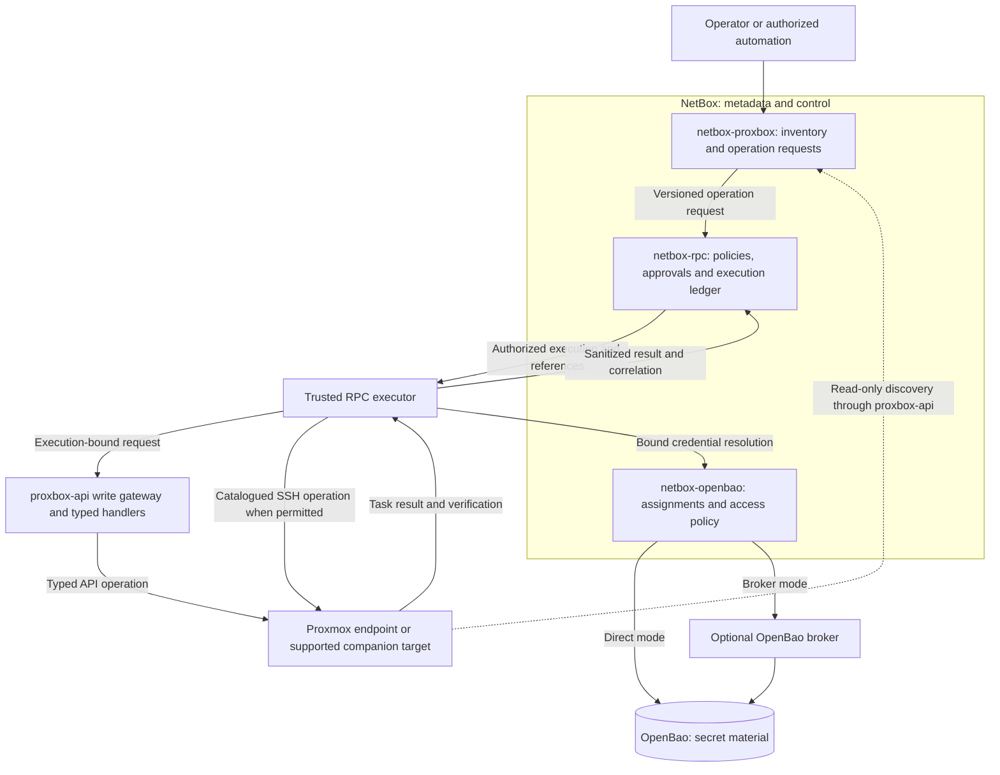
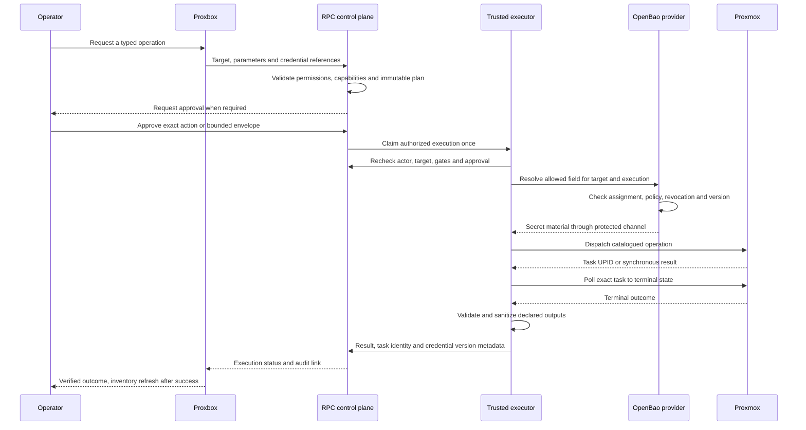
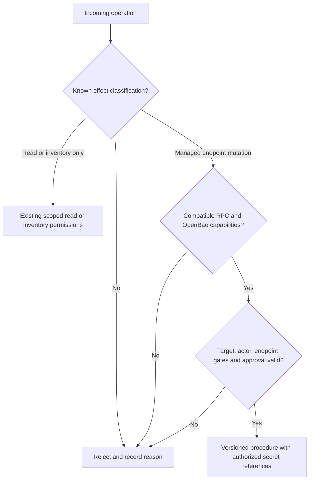
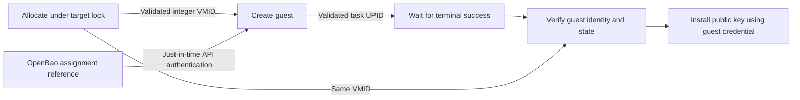
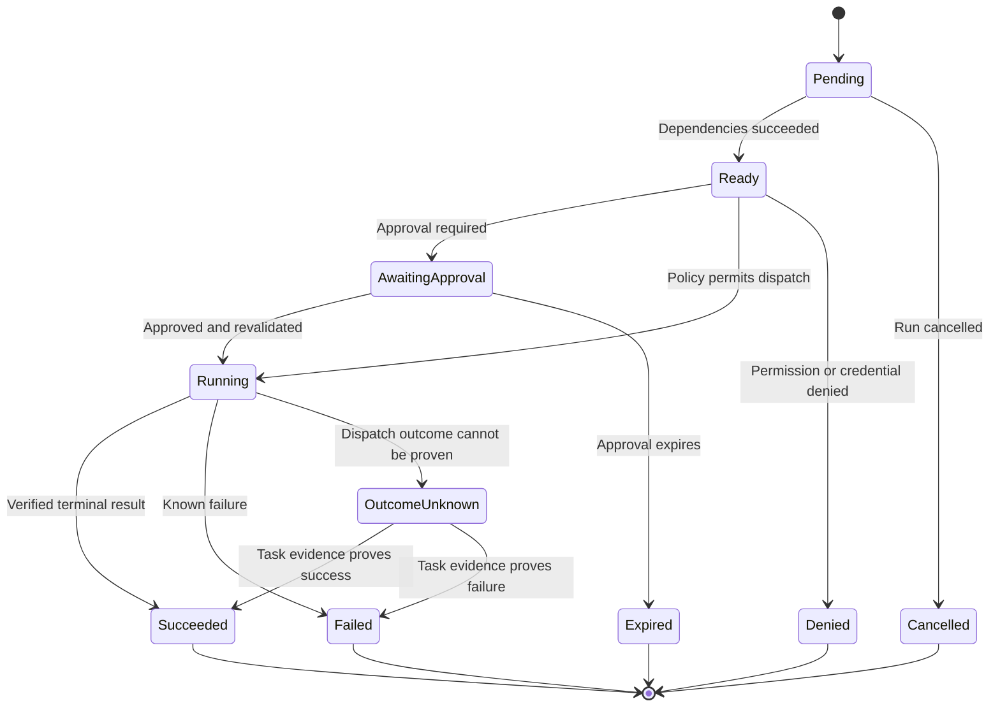
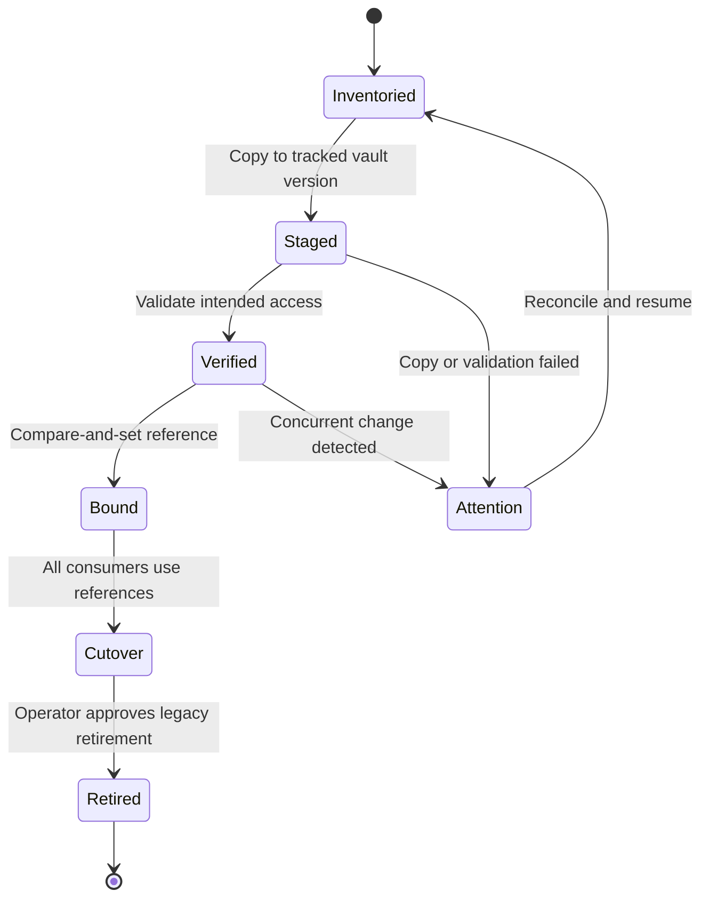

# Audited Proxmox writes with RPC and OpenBao

## Status and scope

This is the technical implementation plan and operator preparation runbook for
integrating **netbox-proxbox**, **netbox-rpc**, and **netbox-openbao**. The target
architecture below is **planned**, not a claim that installing these packages
already routes every write through RPC. Do not enable production writes on the
strength of this document alone. The implementation must publish tested package
versions and pass the acceptance checks before cutover.

The goal is one audited path for every operation exposed by Proxbox that changes
a managed endpoint. NetBox retains inventory, policy, references and execution
history. OpenBao retains sensitive material. RPC authorizes and records each
operation; a trusted executor performs it. Read-only inventory deployments may
continue without the optional operational plugins.

### Existing behavior versus required behavior

| Concern | Existing implementation | Required integration |
|---|---|---|
| Endpoint secrets | `integrations/openbao.py` stores endpoint password, API token, SSH password and keypair through OpenBao | Extend coverage to every store below and provide verified migration |
| Node and service secrets | Several models retain local ciphertext; `NetBoxEndpoint.token_secret` is a character field | Persist references instead of material in mandatory OpenBao mode |
| RPC integration | `integrations/rpc.py` queues SSH-key installation and service collection | Route all enabled endpoint mutations through versioned RPC procedures |
| Operational actions | `views/operational.py` and `views/ha_actions.py` call proxbox-api directly | Create authorized RPC executions and enforce the same boundary in proxbox-api |
| Command variables | RPC already has command templating and command-output capture | Preserve that authoring contract and implement tested standalone-executor parity |
| Procedure chaining | A sequence is not yet a durable output-dependent workflow | Named steps wait for validated predecessor results and survive restarts |
| OpenBao variables | Endpoint storage integration exists | Add a target-bound automation resolver for RPC variables |
| Compatibility | Existing installation pages describe individual components | Publish a tested matrix for NetBox, all three plugins, proxbox-api, RPC backend and optional broker |

## Architecture and trust boundaries

The following diagram describes the **target** architecture. The write gateway
must enforce authorization at the backend transport boundary, not only hide UI
buttons. Direct REST callers, jobs, signals and generated proxy routes must not
be able to bypass it.



RPC is the policy and audit boundary; proxbox-api can retain existing typed
Proxmox handlers behind an authenticated execution-bound gateway. The exact
dispatch envelope and executor ownership must be agreed across repositories
before implementation. An ordinary actor header or possession of the shared
backend API key is insufficient proof of an authorized RPC execution.

An execution binds the initiating operator, executor identity, endpoint and
object identity, operation and procedure versions, validated parameters,
credential purpose and approval snapshot. A service account performs delegated
work; its broad permissions must not replace the initiating operator's rights.
Check those rights again immediately before dispatch and credential resolution.
Scheduled jobs and signals must name an explicitly scoped automation principal;
they cannot inherit ambient service-account authority. Human approval remains
required wherever the operation policy requires it.

Broker mode keeps vault authentication material out of NetBox configuration. It
does not contain a compromised NetBox process that can request legitimate
reveals. Both direct and broker modes must enforce identical target and policy
checks. Material is revealed only to the trusted consumer over authenticated
TLS, for the shortest practical lifetime.

### Execution sequence



Acceptance of an asynchronous task is not success. Correlate the Proxbox
request, intent run, step, RPC execution, credential access and Proxmox UPID.
Persist refusal and uncertain outcomes as well as successful operations.

## Sensitive material inventory and migration targets

This matrix names current sources to migrate; it does not authorize copying
plaintext into issues, exports, logs or migration reports. Inventory metadata
such as usernames, public authorized keys, token IDs and host-key fingerprints
is not itself a private key or password. Restrict metadata access appropriately.

| Current source | Sensitive material | Target reference and migration concern |
|---|---|---|
| `models/proxmox_endpoint.py` | `password_enc`, `token_value_enc`, `ssh_password_enc`, `ssh_private_key_enc` | Reuse the four existing OpenBao UUID references; verify each material type before cutover |
| `models/ssh_credential.py` | Node SSH `password_enc`, `private_key_enc` | Add node-bound password/keypair references; retain username, port and pinned fingerprint |
| `models/netbox_endpoint.py` | Outbound NetBox v2 `token_secret` and material reached through the core token relationship | Move the outbound copy to OpenBao; do not replace NetBox core token ownership or authentication semantics |
| `models/fastapi_endpoint.py` | Backend `token_enc` | Preserve bootstrap, rotation and backend attestation while changing storage |
| `models/pbs_endpoint.py`, `models/pdm_endpoint.py` | `token_secret_enc` | Add purpose-specific PBS/PDM assignments |
| `models/firecracker.py` | Host-agent `agent_token_enc` | Bind to the selected host agent and allowed provisioning operation |
| `models/proxmox_metrics.py` | InfluxDB `query_token_enc` | Bind to the metrics endpoint and read/query purpose |
| `integrations/openbao.py` keypair payload | Private key and optional passphrase | Return a typed keypair to the transport; the existing private-key resolver alone does not expose the complete keypair contract |
| Intent and cloud-init inputs | Guest passwords, private keys and secret-bearing user data | Accept secret references; prevent plaintext persistence in plans, jobs and captured output |
| proxbox-api configuration/database and caches | Replicated endpoint authentication material | Remove durable duplicate material in mandatory mode, while supporting authorized just-in-time read and write clients |

Guest credentials are assigned to the discovered `VirtualMachine` or other
supported object through OpenBao. Inventory discovery must not extract guest
passwords, rotate credentials on a sync failure, or persist guest secrets in
custom fields. Public keys remain safe procedure inputs; private keys do not.

Reconcile any existing external guest credential-store identifier during migration.
OpenBao is the authoritative material store in mandatory mode. If an external
credential store and OpenBao identify conflicting credentials, stop that binding for operator
resolution rather than silently choosing either value. Compatibility adapters
may carry references and non-secret metadata only; they must not maintain a
second copy of the secret. Record the selected assignment and reconciliation
outcome before enabling dependent guest procedures.

### Credential reference contract (proposed)

A versioned reference identifies a credential or assignment UUID, target content
type and object ID, purpose, allowed payload field and version policy. It must
not accept an arbitrary vault path, URL, AppRole, bearer or caller-selected
identity. Reject missing, ambiguous, inactive, wrong-target and wrong-purpose
assignments. Rotation uses a documented live-version policy by default and
records the resolved version; identity-changing rotation invalidates any
approval that depended on the old identity.
Resolve related fields atomically from one selected vault version: an SSH
private key and its passphrase must never come from different live versions.

Only references enter execution parameters, queue messages, snapshots and
fingerprints. Secret values may reach an approved transport credential channel,
stdin, short-lived protected file or API authentication sink. They cannot select
the target, executable, procedure, request URL, output selector or shell fragment.
Mark sensitivity before rendering and capture. Never persist raw output first
and depend on later redaction. Where SSH uses a remote shell, retain the
transport's reviewed quoting and allowlist contract; do not claim it is shell-free.

## Complete operation coverage

Implementation must turn this family-level inventory into a checked row for
every actual exposed operation. Each row needs the UI/API/job caller, backend
route, procedure version, input and result schemas, target, credential purpose,
permissions, approval/effect classification, timeout, idempotency and
reconciliation strategy, completion read and tests. Compare the matrix against
mounted routes and callers in CI; an unclassified mutation blocks enablement.

| Family | Current source surface | Required RPC mapping |
|---|---|---|
| QEMU/LXC operations | `routes/proxmox_actions.py`; Proxbox `views/operational.py` | Start, stop, reboot, delete, migrate and migration cancellation |
| Snapshots and backups | `routes/proxmox_actions.py` | Snapshot create/delete and backup create; separately enumerate any exposed restore/delete operations |
| Branch intent | `routes/intent/apply.py`, `dispatchers/` | QEMU/LXC create, update and destroy with immutable plan and deletion authorization |
| Tags | `routes/proxmox_tags.py`, `routes/intent/vm_tags.py` | Replace/patch tags and pending-deletion tag changes |
| Firewall | `routes/proxmox/firewall.py` | Datacenter/node/guest/vnet rules, groups and group rules, IP sets and entries, aliases and options |
| HA | `routes/proxmox/ha.py`; Proxbox `views/ha_actions.py` | Arm/disarm and any additional exposed HA mutation |
| Datacenter | `routes/proxmox/datacenter.py` | Custom CPU model create/update/delete |
| Cloud guests | `routes/cloud/provision.py`, `lxc.py`, `pve_template.py` | VM/LXC provisioning and template-based creation with exact task results |
| Images and templates | `routes/cloud/template_images.py`, `image_factory.py`, `azure_vhd_imports.py` | Download/import, configuration, conversion, cancellation and explicitly approved cleanup; preserve Packer authorization |
| Firecracker | `routes/cloud/firecracker.py` | Audited host-agent provisioning and any exposed mutation; identify non-PVE transport explicitly |
| Host operations | Proxbox `integrations/rpc.py` | Preserve SSH-key installation and service collection; register missing supported host procedures |
| Disks, storage, replication, SDN, Ceph, PBS/PDM, metrics and access | Current plugin callers, companion integrations and backend routes | Enumerate actual writes individually; mark inventory-only resources explicitly rather than inventing CRUD support |
| Generated/raw proxies | Mounted generated routes and dynamic dispatch | Reject uncatalogued writes; no unrestricted generic command or API-path procedure |
| Browser consoles and SSH terminals | Console/session and terminal handlers | Classify session creation and interactive effects; unrestricted writable terminals are incompatible with RPC-only mode unless governed by an approved RPC session policy |
| Endpoint/configuration administration | Backend endpoint and access configuration routes | Distinguish local metadata changes from managed-endpoint effects; audit and authorize security-relevant gate changes |

All backend paths above are relative to `proxbox_api/`. Read-only status,
discovery, service collection and task polling remain available according to
their existing permissions; POST does not necessarily mean a Proxmox write.
NetBox inventory reconciliation can itself delete stale inventory and still
needs its existing permission classification.



## Procedure variables and output chaining

Reuse existing RPC command authoring (`render_mode`, `produces_var`,
`capture_kind`, `capture_expression`, and `params/target/vars/runtime/item`
roots). The new work is a versioned binding contract and durable cross-procedure
orchestration, including parity in the standalone execution backend.

Each intent run has stable named step instances, allowing the same procedure
more than once. Sources are validated parameters, allowlisted target fields,
earlier command captures, earlier successful step outputs selected by bounded
JSON pointer, or an authorized OpenBao reference. Reject forward references,
cycles, unknown selectors, incompatible types and unbounded output. Persist
non-secret schema-valid results and provenance; secret outputs must become
OpenBao references before durable events or downstream use.

### Proposed authoring example — not an accepted API payload

The following YAML illustrates the contract to implement. The procedure names,
`source` union and workflow schema are proposed; do not submit this to current
REST endpoints. Documentation must replace it with a tested importable example
once exact versions implement the contract.

```yaml
schema_version: 1
steps:
  - id: allocate
    procedure: proxmox.guest.reserve_id
    outputs:
      vmid: {type: integer, minimum: 1, sensitive: false}
  - id: create
    procedure: proxmox.qemu.create
    depends_on: [allocate]
    bindings:
      vmid: {source: step_output, step: allocate, pointer: /vmid}
      api_token:
        source: openbao
        assignment_uuid: "00000000-0000-0000-0000-000000000001"
        target: {content_type: netbox_proxbox.proxmoxendpoint, object_id: 123}
        purpose: proxmox-api
        field: token
        version_policy: live
    outputs:
      upid: {type: string, max_length: 512, sensitive: false}
  - id: wait
    procedure: proxmox.task.wait
    depends_on: [create]
    bindings:
      upid: {source: step_output, step: create, pointer: /upid}
  - id: verify
    procedure: proxmox.guest.verify
    depends_on: [wait]
    bindings:
      vmid: {source: step_output, step: allocate, pointer: /vmid}
```

The UUID and endpoint ID are placeholders, not reusable credentials. The token
binding is secret and permitted only in the handler's API-authentication sink;
it is never a normal command argument. A complete runnable example should then
install a public SSH key using the verified guest and its assigned credential.
Proxmox `nextid` is a lookup, not a reservation: allocation requires locking and
bounded collision handling, with no implicit replay of a guest creation.



Dependent steps run only after successful, schema-valid predecessors. Claim
steps atomically and enqueue after the database transaction commits. Duplicate
callbacks and worker restarts must not dispatch a mutation twice. Failure stops
descendants by default. Approval of a plan must not authorize unknown future
values: approve resolved child parameters or a formally bounded envelope.



Outcome-unknown is an operator-visible reconciliation state, never an automatic
retry instruction. Cancellation requests need their own permission and audit;
they do not imply rollback. No automatic destructive compensation is permitted.

## Installation and operator runbook

### 1. Prepare a compatible installation

Record the NetBox, plugin, proxbox-api, RPC backend, OpenBao and broker versions.
The existing Proxbox compatibility range does not prove composed RPC/OpenBao
support. The implementation must publish an exact tested minimum-version matrix
and capability response. Until then, strict integration readiness is **blocked**.

For a host/venv deployment, use the existing
[plugin installation](../installation/1-installing-plugin.md) and
[backend setup](../installation/backend-setup.md) paths. Add `netbox-proxbox`,
`netbox-rpc` and `netbox-openbao` at the release's tested versions to the
deployment's requirements. Enable them in the NetBox configuration:

```python
PLUGINS = [
    "netbox_proxbox",
    "netbox_openbao",
    "netbox_rpc",
]
```

Retain any other installed plugins. Use the NetBox deployment's normal upgrade
procedure to install dependencies, migrate the database, collect static files
and restart both web and worker processes. These are existing NetBox operations,
not a new integration setup command. Ensure the worker uses the same packages
and configuration as the web process.

For Docker/Compose, follow
[the Docker installation guide](../installation/3-installing-plugin-docker.md):
put pinned plugin requirements in `plugin_requirements.txt`, configure
`configuration/plugins.py`, and build the same custom image for web and workers.
Run migrations and static collection through the documented deployment upgrade
path. Do not install packages only into a running web container.

| Connection | Host/standalone container | Same Compose project |
|---|---|---|
| NetBox to proxbox-api | Reachable backend address and published port, commonly `8800` | Backend service name and container port `8000` |
| proxbox-api to NetBox | Reachable NetBox service address | NetBox service name and container port `8080` |
| Executor/provider to OpenBao or broker | Authenticated reachable TLS address | Service DNS and configured internal TLS port |

Never use browser-visible `localhost` or a host-only `127.0.0.1` published port
as a peer-container address. Persist the backend `/data` volume. During legacy
migration retain the existing encryption key using the documented configuration;
if using its key file, `PROXBOX_ENCRYPTION_KEY_FILE=/data/encryption.key` puts it
on that volume. Do not destroy an old key while encrypted records still depend
on it. Consult the backend setup guide for key generation and attestation.

### 2. Configure OpenBao and assignments

Use the existing OpenBao plugin UI and its
[installation guide](https://github.com/emersonfelipesp/netbox-openbao/blob/main/docs/installation.md)
to configure the instance, KV v2 engine and credential policies. Choose direct or
broker mode deliberately. Configure vault authentication through the supported
settings/secret-loading path, not shell arguments, tracked files or procedure
parameters. Grant only the required engine and credential paths; do not grant a
broad administrator role or create one AppRole per procedure.

Create or select credentials and assign them to the exact endpoint, node or
guest. Set the purpose and permitted field, and ensure password/keypair selection
is unambiguous. Record host-key fingerprints using the existing trusted
verification process. Public-key discovery alone is not approval to trust a key.
Test an allowed access and a denied wrong-target access without logging material.

Bootstrap cannot depend on an RPC execution whose own credentials are not yet
available. An authorized operator must initially provision OpenBao authentication,
the RPC dispatch/executor identities and their minimum policies through the
components' supported installation paths, outside the self-hosted RPC workflow.
Record that bootstrap activity and protect its recovery material. After the
provider and executor can authenticate independently, use audited management
for subsequent supported changes; do not retain a broad bootstrap identity as
the routine execution identity.

### 3. Configure RPC backend and catalog

Configure the existing RPC backend record, dispatch authentication and worker
using the selected RPC release's installation documentation. Confirm backend
health and execution-history access before introducing writes. Catalog seeds,
handler versions and declared capabilities must agree. The standalone backend
must implement command render/capture and the OpenBao provider contract; success
against a legacy backend alone does not prove compatibility.

Install or reconcile only the reviewed Proxmox procedure set. Reconciliation
must be idempotent, preserve operator-owned overrides, report drift and avoid
silently changing approvals. Bind initiating-user and executor permissions
separately. API-only endpoints must never fall back to SSH. Keep endpoint
`enabled`, `allow_writes`, transport restrictions and the separate Packer gate.

### 4. Run integration readiness (planned)

The proposed management commands below are **not implemented commands** and must
not be run against an installation as though this plan supplied them:

```text
manage.py proxbox_openbao_setup --check
manage.py proxbox_openbao_setup --backfill-assignments
```

Implement these commands and a shared UI/API readiness panel before enabling the
feature; this plan does not establish an available strict-mode setting. The
`--check` command must perform read-only validation, report all failures in one
run and exit nonzero when any readiness requirement fails. The panel must use
the same validation service and show the same failures. It must list
all missing capabilities, catalog mappings, schema versions, endpoint bindings,
credential permissions, worker health and migration checkpoints. A second setup
run must produce no duplicate catalog rows or assignments. The proposed
`--backfill-assignments` action must support idempotent reference/assignment
reconciliation, preserve operator-owned choices and report unresolved conflicts;
it must not copy or reveal secret material or grant broad permissions. Preview must not
reveal secrets or contact Proxmox for mutations.

Operators using a management CLI should use its supported virtualization,
RPC procedure and execution-history surfaces, consulting its installed `--help`
for exact verbs. Do not substitute raw host SSH or direct Proxmox API calls for a missing
command. Exact acceptance commands must be published with the implementing
release; the proposed workflow above is not a current executable command.

### 5. Migrate legacy credentials

Back up database and vault metadata according to the deployment's recovery
policy. Produce a secret-free inventory of all sources in the matrix. Use an
additive, resumable migration: copy into a staged version, verify material
through its intended client without displaying it, then compare-and-set the
NetBox reference and activate the approved version. Resolve concurrent rotation
explicitly. Failed database transactions must not delete pre-existing or
concurrently written vault versions. A retry must reuse its migration identity.
If the legacy encryption key is unavailable, stop that record's migration and
report recovery required. Do not replace unreadable ciphertext with an empty
credential or claim it was migrated; use documented recovery or operator-led
credential replacement first.



Existing endpoint OpenBao settings are not proof that backend replicas, node
credentials or metrics tokens have migrated. Verify all consumers before
retiring a local value. Rotation and retirement are separate operations. Keep
the migration ledger and credential version references without material.

### 6. Validate and cut over

In an isolated lab, run the published composed acceptance suite with real
NetBox and OpenBao and an approved Proxmox simulator or lab endpoint. Start with
preview and reads, then one approved reversible write through each mapped family.
Test denied actor, wrong assignment, disabled RPC, incompatible backend, vault
outage and stale approval before enabling broader writes. These must produce no
managed-endpoint mutation. Destructive test operations require separate human
authorization and an isolated disposable target.

Only enable mandatory mode after the checked operation and secret matrices have
no unresolved rows. A partial rollout leaves unsupported writes unavailable.
Roll back by disabling protected writes and retaining audit records and vault
material; never silently restore direct calls or local-secret fallback.

## Failure handling and audit verification

| Condition | Required behavior | Operator evidence |
|---|---|---|
| Missing RPC/provider capability | Refuse before dispatch | Readiness reason and no target task |
| Denied/revoked actor or assignment | Revalidate and deny | Correlated refusal without material |
| Vault/broker outage or expired lease | Fail closed; no local fallback | Provider failure classification and execution state |
| Rotation after approval | Apply declared version policy and invalidate identity-dependent approval | Approved reference and resolved version metadata |
| Invalid or secret-bearing output | Reject output before persistence and stop descendants | Schema failure and sanitized event |
| Duplicate callback or worker restart | Recover claimed step without repeating a mutation | Stable execution/step identity and task evidence |
| Dispatch timeout | Mark outcome unknown and reconcile exact target/task | UPID when known and explicit reconciliation record |
| Partial provisioning | Stop dependent steps; require an explicit recovery plan | Per-step outcomes and retained resource identity |
| Stale destructive approval | Refuse until separately approved | Snapshot mismatch and approval history |

Deletion retains all existing protections, including endpoint permission,
independent confirmation and two-person authorization. An agent must not supply
the human confirmation phrase, self-approve a deletion or enable destructive
gates on the operator's behalf. A general request to run a workflow does not
authorize destroying a VM, disk, snapshot, template or backup.

Audit viewers should navigate from Proxbox request to intent run and step, RPC
execution/events, credential access/version and terminal Proxmox task. Restrict
access to each record by object permissions. Never include bearer values, PEM
contents, passphrases, raw secret stdout or sensitive backend exception text.

## Implementation sequence and acceptance evidence

1. Agree versioned reference, dispatch, output and capability contracts across
   the three plugins and both backends.
2. Implement OpenBao automation resolution and standalone RPC renderer/provider
   parity, with target-bound permissions and secret lifetime tests.
3. Implement additive credential migration and durable named-step orchestration.
4. Seed missing procedures in bounded families with handlers and exact schemas.
5. Replace Proxbox callers and enforce the backend boundary on every write path.
6. Publish tested versions, setup/readiness tooling and an executable example.
7. Validate an empty installation and an upgraded installation, then stage cutover.

Acceptance must demonstrate every operation-matrix row with positive, denial,
failure and asynchronous-completion tests. Secret canaries must be absent from
database material columns in mandatory mode, queue payloads, parameters,
snapshots, events, logs, error bodies and exported results. Test partial output
and exceptions as well as success. Real OpenBao tests must cover CAS conflicts,
staged/live versions, revocation, direct/broker modes and outage recovery.
Include rotation between multi-field reads and scheduled/signal dispatch with
missing or revoked automation principals in negative acceptance cases.

State-machine tests must prove dependency waiting, repeated procedure instances,
type rejection, stale approval denial, duplicate-event handling, restart recovery
and outcome-unknown reconciliation. Composed tests must prove that direct
backend and generated-route attempts cannot bypass RPC. Documentation build,
diagram rendering and successful runbook execution are separate evidence:
rendered diagrams do not prove runtime enforcement.

Maintain requirements-to-test traceability, architecture decisions, migration
checkpoints and release compatibility evidence. Executable changes require the
repository's static analysis, tests and per-function complexity review; this
planning document does not certify those gates. The roadmap remains incomplete
until runtime acceptance passes, even when the documentation is published.

## Related documentation

- [RPC companion integration](./netbox-rpc.md)
- [OpenBao endpoint and guest credentials](./netbox-openbao.md)
- [Companion plugin overview](./index.md)
- [Backend installation and credential recovery](../installation/backend-setup.md)
- [Docker installation](../installation/3-installing-plugin-docker.md)
- [RPC cross-plugin integration](https://github.com/N-MultiCloud/netbox-rpc/blob/main/docs/cross-plugin-integrations.md)
- [OpenBao broker and RPC architecture](https://github.com/emersonfelipesp/netbox-openbao/blob/main/docs/architecture/openbao-broker-rpc.md)
