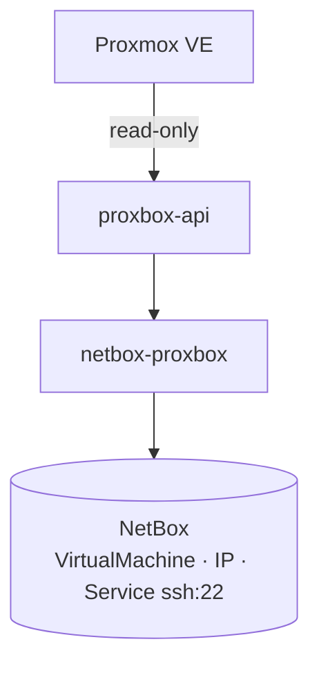
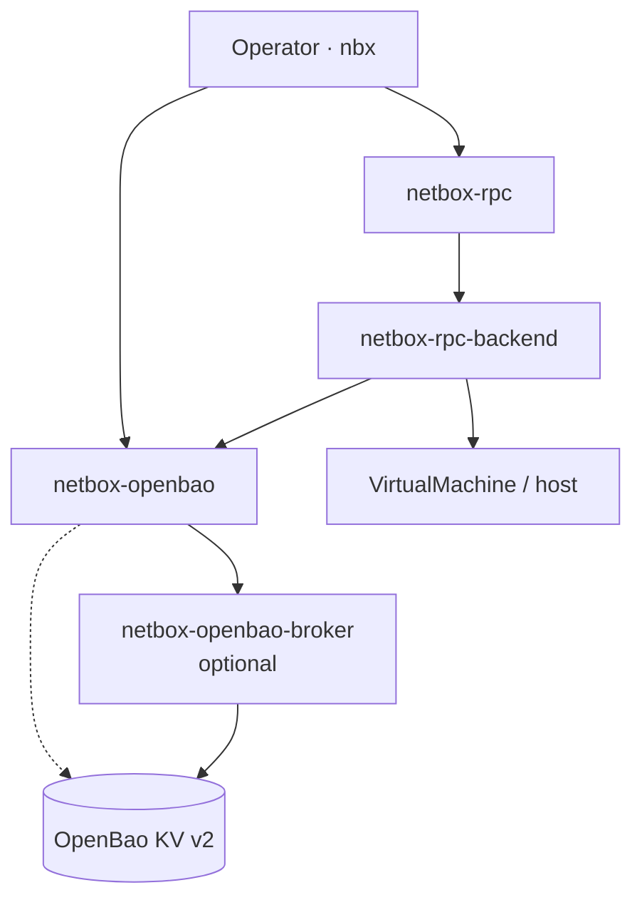

# netbox-openbao — VM and container SSH secrets

The complete target architecture, migration matrix and setup runbook are in
[Audited Proxmox writes with RPC and OpenBao](./audited-proxmox-writes.md).
Mandatory RPC writes and generic OpenBao-backed procedure variables are planned;
the endpoint storage integration described here already exists.

Unavailable required credentials fail explicitly at secret-access boundaries.
Password-reuse readiness and list views report SSH as unavailable instead of
failing the entire response. SSH password reuse returns a safe 503 when stored material cannot be
resolved; a token-only endpoint still returns 422 because an API token is not an
SSH password. Scheduled monitoring records an affected endpoint's failure and
continues evaluating other endpoints.

Endpoint edit forms preserve masked values from the original storage backend,
using the submitted authentication selection after explicit clears. A complete
new token pair can repair an endpoint that has no stored credentials. An existing
unresolved counterpart reference still blocks preservation until the operator
repairs, replaces, or explicitly clears that credential. The requesting actor is
retained for authorized OpenBao reads and writes.

`netbox-openbao` is a **separate** NetBox plugin from the Proxbox suite. It is
not a companion plugin in the same sense as netbox-pbs or netbox-ceph — you do
not install it through proxbox-api sync jobs — but it is the supported way to
store SSH login material for Proxmox guests that netbox-proxbox already models
in NetBox.

## Problem split

| Concern | Plugin | Storage |
|---|---|---|
| Discover VMs, LXC, interfaces, IPs | **netbox-proxbox** (+ proxbox-api) | NetBox PostgreSQL |
| Store SSH passwords and keypairs | **netbox-openbao** | OpenBao KV v2 + NetBox metadata |
| Optional vault credential isolation | **netbox-openbao-broker** | AppRole off the NetBox host |
| Audited SSH / host procedures | **netbox-rpc** (+ rpc-backend) | Procedure catalog in NetBox |

Proxbox answers *what exists*. Openbao answers *how you log in* — after the
object exists. RPC answers *what automated host operations are allowed* — through
a catalogued executor, not ad-hoc shell.

!!! important "No secrets in the sync pipeline"
    Proxmox guest credentials — cloud-init passwords, hypervisor-stored root
    passwords, QEMU agent secrets — are **not** part of the proxbox discovery
    contract. A proxbox job failure must not rotate credentials; a credential
    reveal must not call the Proxmox API.

## Architecture

### Inventory lane (netbox-proxbox)



### Target secrets and automation stack

The RPC-to-OpenBao executor link below is the planned generic integration. Its
presence in this diagram does not establish runtime support in an installed
executor; verify the capability and version contract before enabling writes.



The inventory and secrets lanes meet on the same `VirtualMachine` (or `Device`)
row. Guest assignment coordinates through NetBox objects and OpenBao assignments.
Endpoint storage additionally uses Proxbox's optional `integrations/openbao.py`
adapter, which imports OpenBao models and services at call time.

## Endpoint credentials vs guest credentials

netbox-proxbox can also store **Proxmox endpoint** tokens and SSH secrets
through netbox-openbao when
`ProxboxPluginSettings.credential_storage_backend = openbao`. Automatic (the
blank default) selects that backend only when `netbox_openbao` is enabled in
`PLUGINS`; otherwise it selects legacy Fernet. Explicit selections remain
authoritative and never downgrade when OpenBao becomes unavailable. That
path secures *how NetBox talks to Proxmox*, not *how operators SSH into a synced
guest*.

Missing OpenBao references and invalid or unavailable material fail explicitly
with the endpoint and credential field named. Existing stored backend choices
are preserved during upgrade; the automatic default does not migrate secrets.
See [credential storage configuration](../configuration/plugin-settings.md#encryption-and-credential-storage)
before changing the enabled plugin set.

| Credential | Stored by | Bound to |
|---|---|---|
| Proxmox API token / endpoint SSH | proxbox + openbao integration | `ProxmoxEndpoint` |
| Guest SSH login | openbao quick-add | `VirtualMachine` + optional `ipam.Service` |

Do not conflate the two: rotating an endpoint token does not create a guest SSH
credential, and quick-add on a VM does not replace endpoint API authentication.

## Operator workflow

1. **Sync inventory** — manual sync, scheduled job, or proxbox-api SSE workflow
   so the VM or container exists under the correct cluster and node.
2. **Add SSH access** — on the VirtualMachine page, use netbox-openbao's
   quick-add to create `Credential`, assignments, and `ssh` service (when
   services are modeled) in one transaction.
3. **Reveal when needed** — operators or automation with `reveal_credential`
   POST to `/api/plugins/openbao/credentials/{id}/reveal/`; material never
   appears on GET or in exports.
4. **Optional automation** — use the installed RPC release's supported fixed
   host procedures. Generic execution-bound OpenBao resolution is part of the
   integration plan; do not assume every executor implements it.

## Installation

Install the plugins in NetBox; proxbox must be present before sync can create VM
rows:

```bash
pip install netbox-proxbox netbox-openbao netbox-rpc
```

```python
PLUGINS = [
    "netbox_proxbox",
    "netbox_openbao",
    "netbox_rpc",
]
```

Deploy **netbox-openbao-broker** when broker mode should keep AppRole material
off the NetBox host. Configure OpenBao engines and policy tiers per
[netbox-openbao installation](https://github.com/emersonfelipesp/netbox-openbao/blob/main/docs/installation.md).

## Further reading

- [netbox-openbao: OpenBao, broker, and RPC stack](https://github.com/emersonfelipesp/netbox-openbao/blob/main/docs/architecture/openbao-broker-rpc.md)
- [netbox-openbao: Proxmox VM secrets architecture](https://github.com/emersonfelipesp/netbox-openbao/blob/main/docs/architecture/proxmox-vm-secrets.md)
- [netbox-openbao: Quick-add SSH](https://github.com/emersonfelipesp/netbox-openbao/blob/main/docs/quick-add-ssh.md)
- [Interactive diagrams on emersonfelipesp.com](https://emersonfelipesp.com/netbox-openbao/proxmox-secrets)
- [Companion plugins overview](./index.md)
