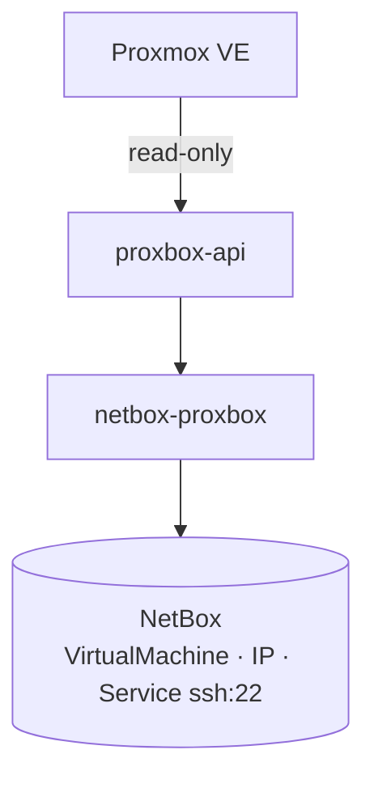
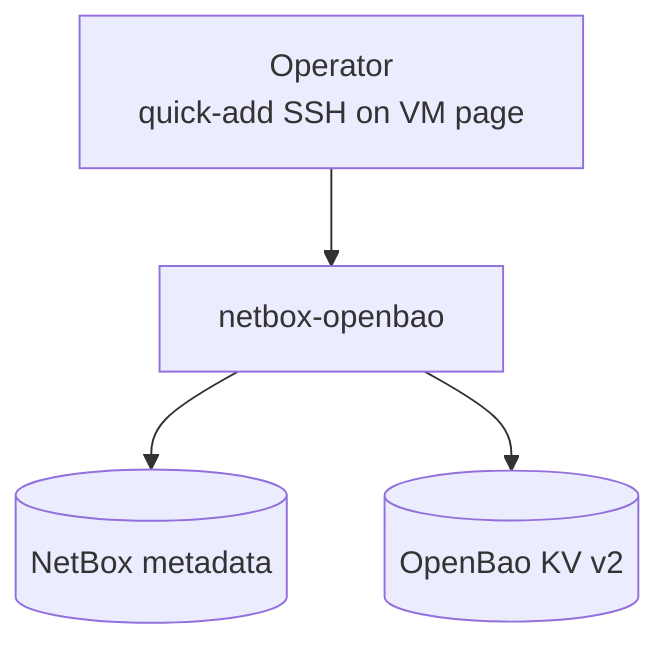

# netbox-openbao — VM and container SSH secrets

`netbox-openbao` is a **separate** NetBox plugin from the Proxbox suite. It is
not a companion plugin in the same sense as netbox-pbs or netbox-ceph — you do
not install it through proxbox-api sync jobs — but it is the supported way to
store SSH login material for Proxmox guests that netbox-proxbox already models
in NetBox.

## Problem split

| Concern | Plugin | Storage |
|---|---|---|
| Discover VMs, LXC, interfaces, IPs | **netbox-proxbox** (+ proxbox-api) | NetBox PostgreSQL |
| Store SSH passwords and keypairs | **netbox-openbao** | OpenBao KV v2 + NetBox metadata |
| Optional NMS/RPC mirror for passwords | **netbox-nms** | Same OpenBao material |

Proxbox answers *what exists*. Openbao answers *how you log in* — after the
object exists.

!!! important "No secrets in the sync pipeline"
    Proxmox guest credentials — cloud-init passwords, hypervisor-stored root
    passwords, QEMU agent secrets — are **not** part of the proxbox discovery
    contract. A proxbox job failure must not rotate credentials; a credential
    reveal must not call the Proxmox API.

## Architecture

### Inventory lane (netbox-proxbox)



### Secrets lane (netbox-openbao)



The two lanes meet on the same `VirtualMachine` (or `Device`) row. Neither
plugin imports the other; coordination is entirely through NetBox objects and
operator workflow.

## Endpoint credentials vs guest credentials

netbox-proxbox can also store **Proxmox endpoint** tokens and SSH secrets
through netbox-openbao when
`ProxboxPluginSettings.credential_storage_backend = openbao` (default). That
path secures *how NetBox talks to Proxmox*, not *how operators SSH into a synced
guest*.

| Credential | Stored by | Bound to |
|---|---|---|
| Proxmox API token / endpoint SSH | proxbox + openbao integration | `ProxmoxEndpoint` |
| Guest SSH login | openbao quick-add | `VirtualMachine` + optional `ipam.Service` |

Do not conflate the two: rotating an endpoint token does not create a guest SSH
credential, and quick-add on a VM does not replace endpoint API authentication.

## Operator workflow

1. **Sync inventory** — manual sync, scheduled job, or proxbox-api SSE workflow
   so the VM or container exists under the correct cluster and node.
2. **Add SSH access** — on the VirtualMachine page, use netbox-openbao's
   quick-add to create `Credential`, assignments, and `ssh` service (when
   services are modeled) in one transaction.
3. **Reveal when needed** — operators or automation with `reveal_credential`
   POST to `/api/plugins/openbao/credentials/{id}/reveal/`; material never
   appears on GET or in exports.

When netbox-nms is present, password quick-add mirrors into `DeviceCredential`
for RPC consumers.

## Installation

Install both plugins in NetBox; order relative to netbox-proxbox does not
matter for VM secrets, but proxbox must be present before sync can create VM
rows:

```bash
pip install netbox-proxbox netbox-openbao
```

```python
PLUGINS = [
    "netbox_proxbox",
    "netbox_openbao",
    # "netbox_nms",  # optional mirror for RPC/NMS
]
```

Configure OpenBao engines and policy tiers per
[netbox-openbao installation](https://github.com/emersonfelipesp/netbox-openbao/blob/main/docs/installation.md).

## Further reading

- [netbox-openbao: Proxmox VM secrets architecture](https://github.com/emersonfelipesp/netbox-openbao/blob/main/docs/architecture/proxmox-vm-secrets.md)
- [netbox-openbao: Quick-add SSH](https://github.com/emersonfelipesp/netbox-openbao/blob/main/docs/quick-add-ssh.md)
- [Interactive diagrams on emersonfelipesp.com](https://emersonfelipesp.com/netbox-openbao/proxmox-secrets)
- [Companion plugins overview](./index.md)
