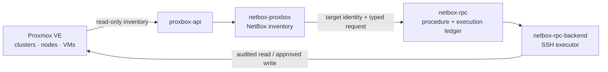
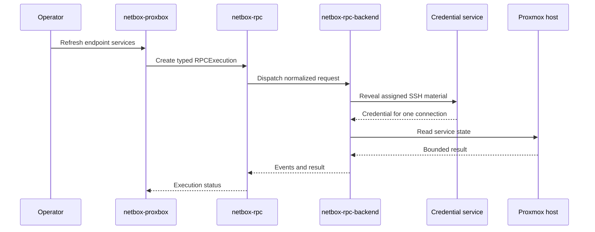

# netbox-rpc — audited Proxmox host procedures

See [Audited Proxmox writes with RPC and OpenBao](./audited-proxmox-writes.md)
for the operation matrix, typed chaining design, migration and setup runbook.
The universal write boundary is planned; current optional integrations below do
not establish that every Proxbox write already passes through RPC.

`netbox-rpc` is an operational companion for `netbox-proxbox`. Proxbox owns
Proxmox inventory and endpoint configuration; RPC owns the policy and audit
record for host operations. Installing the package does not enable it, and
enabling the integration does not change the read-only inventory sync contract.

## Boundary

The sync lane discovers clusters, nodes, guests, interfaces, addresses, and
service metadata. It does not carry a guest password or private key. The RPC
lane starts only after a target object exists in NetBox and a matching
procedure is enabled for that target model.

## What the integration uses

`netbox-proxbox` supplies:

- the `ProxmoxEndpoint` and related inventory objects;
- endpoint enablement and write-policy gates;
- the target identity and connection metadata needed to select a procedure;
- the operator-facing service-monitoring action when that feature is enabled.

`netbox-rpc` supplies:

- the `RPCProcedure` catalog and target-model contract;
- structured parameter and result schemas;
- effect classification and approval requirements;
- `RPCExecution` and event history;
- the dispatch handoff to `netbox-rpc-backend`.

`netbox-rpc-backend` supplies the fixed-argv or typed CLI execution, SSH
connection, bounded output, and host-side result. Proxbox's optional
`integrations/rpc.py` adapter imports RPC models and jobs at call time.

## Procedure families

The primary Proxbox integration is the read-only
`os.linux.proxmox.show_systemctl_services` procedure. It accepts a bounded list
of unit names, verifies that the endpoint in the request is the assigned
target, and returns service state through the execution ledger. It is used for
agentless endpoint service monitoring.

Other host procedures may be available as the catalog grows, but each one must
be seeded with an explicit target model, schema, effect, and matching backend
handler. A procedure that is not present in the catalog is not an implicit
permission to open SSH or run a host command.

### Read-only monitoring

The service-monitoring action is an opt-in read path:

1. Proxbox confirms that the endpoint is enabled and eligible for monitoring.
2. Proxbox creates an RPC execution for the endpoint and the allowlisted unit
   names.
3. The RPC worker dispatches to the backend and records progress/result data.
4. Proxbox renders the latest state without changing the Proxmox host.

An unavailable backend, disabled endpoint, invalid unit name, or failed SSH
connection produces a visible failed/unknown monitoring result. It does not
fall back to an untracked command.

### Writes and approval

Some RPC procedures are writes or destructive operations. Their effect and
`approval_required` values are part of the catalog and must be shown before
dispatch. A Proxbox UI action cannot bypass those gates, and inventory sync
never triggers a write procedure as a side effect.

## Credentials

Endpoint or host SSH material is resolved by the configured credential
integration at execution time. Guest passwords and private keys are not part of
the inventory discovery contract or service-monitoring parameters. Endpoint
credential registration is a separate path; the complete integration plan
covers retiring its replicated material. When
`netbox-openbao` is installed, assignments and reveal authorization remain in
that plugin; an optional `netbox-openbao-broker` can hold the vault AppRole
behind mTLS.

The sequence below illustrates the intended credential-service boundary.
Generic execution-bound OpenBao resolution in the standalone executor remains
planned; validate the installed backend's actual credential path and capabilities.

## Operator flow

1. Confirm the `ProxmoxEndpoint` is enabled and that the RPC integration is
   enabled for the endpoint.
2. Confirm the endpoint has the required SSH identity and pinned host-key
   policy in the credential workflow.
3. Use the Proxbox service-monitoring action or select the matching RPC
   procedure from the catalog.
4. Review target, unit list, effect, and approval requirement before dispatch.
5. Follow the RPC execution events and use the result/history for troubleshooting
   and audit.

For a full view of how Proxbox, OpenBao, Packer, fileserver, and proxy plugins
share the RPC contract, read the [`netbox-rpc` cross-plugin integration guide](https://github.com/N-MultiCloud/netbox-rpc/blob/main/docs/cross-plugin-integrations.md)
or the [interactive diagrams](https://emersonfelipesp.com/netbox-rpc/integrations).

## Installation and compatibility

Install and enable the plugin alongside Proxbox according to the main
[companion-plugin overview](./index.md). Keep the RPC package and its execution
backend on compatible versions, run migrations for both enabled plugins, and
verify the procedure catalog before enabling service monitoring.

The integration is additive: Proxbox inventory remains usable when RPC is not
installed or when the RPC opt-in is disabled.
