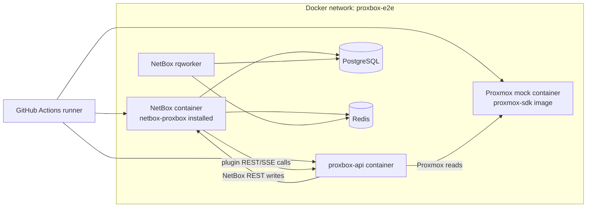
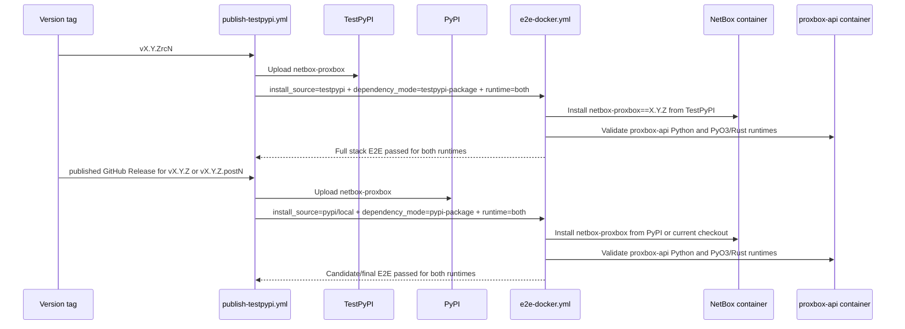

# CI and E2E Workflows

This page documents the developer-facing GitHub Actions surface for
`netbox-proxbox`: the fast CI checks, the Docker E2E stack, docs automation, and
the staged TestPyPI/PyPI release pipeline.

## Workflow Map

| Workflow | Trigger | Purpose |
|---|---|---|
| `.github/workflows/ci.yml` | Push and pull request | Runs lint, type checks, compile checks, and the mocked pytest suite. NetBox-dependent Django tests skip here. |
| `.github/workflows/django-tests.yml` | Push, tag, and pull request | Provisions a real NetBox source tree (matrixed over the supported 4.5.x and 4.6.x lines) plus PostgreSQL and Redis, installs the plugin `test` extra (`pytest-django` included), and runs the NetBox-backed Django TestCase suite for sync-state and endpoint auto-configuration. A fifth 4.6.x cell installs a pinned supported `netbox-pdm` checkout and enables it so the optional registry override is exercised. It hard-fails a missing harness and independently enforces at least 85% branch coverage for `services.endpoint_autoconfiguration` and `api.serializers.resource_views`; aggregate coverage cannot let either module mask the other. |
| `.github/workflows/e2e-docker.yml` | Manual, scheduled, reusable workflow call | Builds a real NetBox stack with the plugin, rqworker, `proxbox-api`, PostgreSQL, Redis, and a mocked Proxmox API. |
| `.github/workflows/publish-testpypi.yml` | `v*rc*` tag push or RC-only manual dispatch (TestPyPI); GitHub Release published (PyPI) | Promotes the exact linked Gitea artifacts. Each isolated upload job checks out the exact source SHA before its locked publisher sync. Official PyPI releases require the already-pushed final tag, a verified host-issued package deployment receipt, and `gh release create --verify-tag`; plain non-RC tag pushes do not trigger publishing. |
| `.github/workflows/docs.yml` | Docs changes on main / PR | Builds and publishes the MkDocs site. |
| `.github/workflows/docs-screenshots.yml` | Manual dispatch | Refreshes committed UI screenshots used by the docs site. |
| `.github/workflows/nightly-contracts.yml` | Schedule / manual dispatch | Checks cross-repo contracts that must stay aligned with `proxbox-api`. |

## Authenticated Exact-Commit Matrix Bootstrap

Issue #300 adds `scripts/wait_for_github_django_matrix.py` as a reviewed
target-branch artifact. This bootstrap must not enable a Gitea consumer. No
private pre-merge or deployment workflow calls it yet, and its presence does
not promote the public Django matrix to trusted evidence.

### Trust boundary

The public matrix is **non-security evidence** while the candidate commit owns
the installed plugin package and its tests. Pinning the workflow prevents a
candidate from replacing `django-tests.yml` with a no-op success, but it cannot
prevent candidate package or test code from changing its own behavior. A
future **base-pinned external supervisor** is required before a matrix result
can become security-critical evidence. That supervisor must execute the waiter
from an immutable reviewed target-branch checkout, never from the candidate
checkout.

The supervisor supplies the expected short candidate branch, full lowercase
40-character SHA, positive GitHub run ID via `--expected-run-id`, and positive
run-attempt number via `--expected-run-attempt`. Both members of that trusted
pair are mandatory. A UTC `YYYY-MM-DDTHH:MM:SSZ` creation-time floor via
`--not-before` is an optional additional bound, never a standalone selector.
The waiter accepts only a completed successful `push` attempt whose
repository, head repository, branch, SHA, head-commit ID, workflow ID, workflow
API URL, and exact bare workflow path `.github/workflows/django-tests.yml` all
match. GitHub's workflow-run response returns that path without a branch suffix, so
branch provenance is deliberately bound through the separately checked
`head_branch` and run name. The pinned workflow's GitHub-generated run name
must contain the exact `refs/heads/<branch>` and SHA, removing the ambiguity
when a tag shares a branch name and commit. A tag push, pull-request run,
same-SHA run from another branch, or run of another workflow is rejected.
Before polling, the waiter reads
`.github/workflows/django-tests.yml` at that exact SHA and requires GitHub's Git
blob identity to equal the reviewed `PINNED_WORKFLOW_BLOB_SHA` constant.
The pin intentionally remains the previously reviewed base blob while this
change edits the candidate workflow. That mismatch is fail-closed, not a defect:
candidate code must never update the value that authorizes itself.

Discovery polls only
`/repos/{owner}/{repo}/actions/runs/{run_id}/attempts/{attempt}` from the
outset. HTTP 404 is treated as a not-yet-visible state and retried only within
the shared deadline and request cap. The waiter never lists filtered workflow
runs, so a crowded first page or a run flood cannot displace the trusted pair.
Every returned response must match the pinned ID and attempt before its status
is considered. A prior successful attempt of the same run cannot satisfy a
newer pinned attempt.

### Credential and network boundary

The credential must be a short-lived, base-owned GitHub App user access token
(`ghu_…`). Preferred ingress is `GH_MATRIX_READ_TOKEN_FILE`, set to a regular
file that denies all group and other permissions (for example mode `0600` or
`0400`) and is readable only by the waiter. The waiter reads and strips that
file without placing the token value into `os.environ`. `GH_MATRIX_READ_TOKEN`
remains a fallback and the file wins when both variables are set. The
authenticated user must be the repository owner, and the token must expose
exactly one accessible app installation. The waiter exhausts installation
pagination before accepting it; any second installation, including one for an
unrelated private owner, is over-scope and is rejected. The sole installation
must belong to the repository owner and select only
`emersonfelipesp/netbox-proxbox` with exact repository `Actions: read`,
`Contents: read`, and the implicit `Metadata: read` permission. This token form
is deliberate: its authenticated-user installation response exposes the app's
permissions, allowing the waiter to reject an under- or over-scoped token
instead of treating public anonymous API access as proof of authorization.

Environment fallback has a narrower guarantee. Removing
`GH_MATRIX_READ_TOKEN` from `os.environ` cannot erase the process's original
environment block: same-runner processes with proc access may still read the
token from `/proc/<pid>/environ`, and Python startup hooks run before the waiter
can remove it. File ingress avoids those environment exposures because only the
file path enters the initial environment and `main()` verifies isolated mode
before reading the file. The executable shebang enables Python isolated mode;
an explicit caller must likewise invoke a reviewed interpreter with `python
-I`.

The waiter does not spawn or shell out to another process, disables ambient
proxies and redirects, and sends requests only to its fixed
`https://api.github.com` endpoint allowlist. The waiter cannot enforce
UID/PID-namespace, same-runner process, or core-dump isolation. Those remain
external-supervisor obligations.
Its authentication preflight verifies the authenticated owner, exactly one
accessible unsuspended app installation, exact read permissions, single exact
repository selection, and authenticated rate-limit headers. Missing,
malformed, invalid, suspended, under-scoped, over-scoped, or wrong-repository
credentials fail before candidate verification begins.

The secret-injection boundary—not candidate convention—is what protects the
credential. The future supervisor must keep the token file and either ingress
variable outside every candidate checkout, container, environment, hook,
subprocess, and log. Candidate code must never run in the waiter's process, and
the waiter must never run with a candidate-controlled Python path or startup
customization.

Connection attempts, response reads, JSON parsing, transient retries,
rate-limit waits, and workflow polling all consume one 45-minute monotonic
deadline. JSON responses have a one-MiB ceiling. A 403 is retried only when
GitHub supplies `Retry-After` or an exhausted primary-rate-limit header pair;
other 403 responses fail as invalid or under-scoped authentication. Each gate
has a hard 200-request cap. Four concurrent default gates therefore reserve at
most 800 requests plus a 200-request safety margin, below the authenticated
5,000-request hourly floor; authentication refuses to start below that shared
1,000-request remaining budget.

### Bootstrap order

1. Land and review a candidate workflow change without updating the existing
   trusted workflow blob pin. The changed workflow is not trusted evidence yet.
2. In a separate change based on the newly reviewed target branch, compute and
   review the exact workflow Git blob, then update only the base-owned waiter
   pin and its static contract. The workflow change cannot self-authorize.
3. Build a base-pinned external supervisor that obtains branch/SHA provenance
   plus the expected GitHub run-ID/attempt pair and any optional not-before
   creation time from the trusted control plane, then invokes the waiter from
   reviewed base code. Prefer provisioning the GitHub App token through a
   waiter-only private file and keep it outside every candidate process.
4. Validate the supervisor and secret boundary independently. Until this is
   complete, public matrix results remain non-security evidence.
5. Only then enable a Gitea pre-merge or deployment consumer in a separate,
   reviewed change. The consumer may rely only on the supervisor's exact-run
   verdict, never directly on a candidate-controlled workflow success.

## Django Test Database

`django-tests.yml` relies on the hardcoded `matrix.netbox` allowlist for the
NetBox checkout ref. Do not replace that with event input or any other untrusted
value.

The optional PDM cell pins a
revision that already registers its own `PDMEndpointView`, proves that identity,
then proves the Proxbox detail override replaces and renders it.

The job sets `DJANGO_SETTINGS_MODULE=netbox.settings` and
`NETBOX_CONFIGURATION=tests.netbox_test_configuration`, then runs pytest with
`--ds=netbox.settings --reuse-db --create-db`. `pytest-django` creates the test
database and applies the real NetBox/plugin migrations; the job deliberately
does not use `--no-migrations` because the sync-state TestCases exercise real
tables and migration reversals. `NETBOX_PROXBOX_REQUIRE_DJANGO=1` converts a
missing dependency, failed `django.setup()`, or broken DB harness into a hard
failure instead of a module-level skip.

The ordinary CI and both release candidate-validation jobs run the mocked suite
with `-p no:django`. This is deliberately per invocation: setting it globally
would disable the plugin needed by this real-NetBox job. Local disposable
services can set `NETBOX_TEST_DB_HOST`, `NETBOX_TEST_DB_PORT`,
`NETBOX_TEST_REDIS_HOST`, and `NETBOX_TEST_REDIS_PORT`; hosted CI retains the
stock service host and ports.

The pytest coverage collection uses both real-Django modules with an aggregate
report only for visibility. Two subsequent `coverage report --include=...`
commands apply `--fail-under=85` to each module independently. Never replace
them with a single aggregate threshold.

### Semantic MCP paired-SDK activation

The Proxbox descriptor is producer-side code, but operational MCP availability
requires one exact compatible `netbox-sdk` artifact. No released SDK currently
passes that contract. `tests/fixtures/netbox_sdk_bridge_activation.json`
therefore says `blocked`, contains no invented version or commit, and the mocked
suite asserts that no workflow presents
`tests/validate_paired_netbox_sdk_bridge.py` as active evidence.

Activation is a separate reviewed change after an exact SDK release exists. It
must explicitly provision that immutable artifact, record its exact released
version and full Git commit plus `netbox_sdk/plugin_bridge.py` origin, invoke the
paired script with all identity arguments, and require the lossless endpoint-ID
and bounded RFC 3339 vectors. Ambient `PYTHONPATH`, a mutable branch, or a
candidate-supplied version claim is not identity evidence. Until then, a public
workflow success proves only the Proxbox producer contract, not MCP consumer
compatibility.

The target Gitea release-request workflow subscribes to tag `push` only, not
manual dispatch or the overlapping `create` event. Gitea emits both tag events,
and accepting both would race duplicate immutable requests. It uploads exactly
the wheel, sdist, manifest, canonical request, supervisor completion statement,
and detached signature. The separately administered locked release-control
workflow verifies that signed completion before sealing and is the sole manual
publication entry point.
`tests/test_pytest_django_scope.py` pins the target trigger contract.

## Docker E2E Stack

`e2e-docker.yml` validates the real runtime integration. The plugin is installed
inside NetBox, while the backend is always a separate HTTP service.

The reusable inputs select what is under test:

| Input | Values | Effect |
|---|---|---|
| `install_source` | `local`, `pypi`, `testpypi`, `container`, `both` | Selects how `netbox-proxbox` is installed inside the NetBox container. |
| `dependency_mode` | `dev`, `published`, `testpypi-package`, `pypi-package` | Selects how the separate `proxbox-api` container is built or installed. |
| `proxbox_api_version` | Version string | Pins the backend package version for TestPyPI/PyPI package-index E2E modes. |
| `proxbox_api_runtime` | `python`, `pyo3-rust`, `both` | Selects the backend reconciliation runtime. `both` is the default and doubles the matrix. |
| `netbox_image` | Full image ref | Overrides the NetBox image; default matrix covers `v4.5.8` through `v4.5.10`, `v4.6.0` through `v4.6.6`, and official `v4.7.0` GA. |
| `proxmox_service` | `pve`, `pbs`, `pdm`, `all` | Selects the proxmox-sdk mock image suffix. `all` runs the full per-service matrix. |

The `pyo3-rust` runtime uses the `proxbox-api` `raw-pyo3-rust` Docker target in
development mode, `<version>-pyo3-rust` Docker tags in published-image mode, and
`proxbox-api[pyo3-rust]` in package-index modes with a fallback to the matching
Docker tag when the selected backend package has not shipped the extra yet.
Each Rust cell asserts `PROXBOX_RECONCILIATION_ENGINE=rust` and
`rust_available()` before running sync checks.

### Proxmox Service Matrix

The mock container is split by service: `emersonfelipesp/proxmox-sdk:latest-pve`,
`latest-pbs`, and `latest-pdm`. The default `proxmox_service: all` expands all
three. `pve` runs the full sync flow; `pbs` and `pdm` run stack health and
plugin-internal contract checks while skipping PVE-specific object assertions.

## Release Validation

The release workflow intentionally never reuses a consumed package version.
Failures after package upload move forward to the next `.postN` or `rcN`.

## Developer Checklist

- Keep package version metadata synchronized across `pyproject.toml`,
  `netbox_proxbox/__init__.py`, `uv.lock`, and the Git tag.
- Use TestPyPI `proxbox-api` for TestPyPI `netbox-proxbox` E2E.
- Use PyPI `proxbox-api` for PyPI release-candidate and final E2E.
- Keep `proxbox_api_runtime: both` in release workflow callers so PyPI
  publication is blocked when Rust-backed sync fails.
- Do not add `twine --skip-existing`; consumed versions are immutable and must
  be fixed forward.
- When changing sync contracts shared with the backend, run the mocked tests,
  the workflow contract tests, and a Docker E2E run before release.
