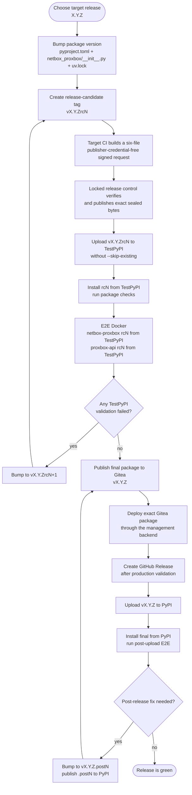
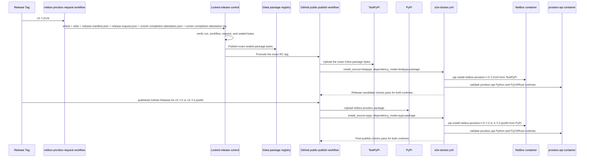

# Release Publishing

This page documents the staged package-release workflow for `netbox-proxbox` and
its companion `proxbox-api` backend. The workflow deliberately separates package
index validation from final publication so failed published artifacts are never
reused.

For the broader CI job map and Docker E2E matrix, see
[CI and E2E Workflows](ci-e2e-workflows.md).

## Release State Machine



## Cross-Package E2E Contract

The plugin does not import `proxbox-api` as a Python dependency. It consumes the
backend as a runtime HTTP service, so release coupling is validated in Docker
E2E rather than package metadata.



## Workflow Rules

- `pyproject.toml`, `netbox_proxbox/__init__.py`, `uv.lock`, and the Git tag
  must all describe the same version.
- `rcN` tag pushes (pattern `v*rc*`) publish to TestPyPI for release-candidate
  validation.
- Official releases (`vX.Y.Z`, `vX.Y.Z.postN`) are triggered **only** by GitHub
  release creation (`release: published`) cut from the `develop` branch after
  the final Gitea package and the production deployment gates. Plain non-rc tag pushes do
  **not** trigger public publishing. Manual workflow dispatch is TestPyPI-only
  and requires an RC version.
- Package uploads intentionally omit `twine --skip-existing`; a consumed version
  must move forward to the next `.postN` or `rcN`.
- The Gitea publisher installs no executable tools. Its runner image must
  already provide exactly Python 3.12.14 and uv 0.12.5; the build uses the
  locked Hatchling 1.31.0 from that interpreter's synchronized environment
  with PEP 517 build isolation disabled. An RC promotion also requires a
  pre-provisioned, authenticated GitHub CLI. Missing or unexpected tooling
  fails before a distribution is built or a package credential is used.
- The workflow is dispatched only from canonical Gitea `main`; pushing a tag
  cannot invoke the publisher, and both release workflows require the exact
  canonical repository identity. It checks out the immutable dispatch SHA as the
  control tree and checks out the requested tag under `candidate/` as passive
  build input using the peeled commit exported by validation. The publisher
  fetches the tag again and requires both its raw object and peeled commit to
  equal the validation outputs, so a tag move between jobs fails. Before
  Hatchling receives that input, the canonical helper
  requires the exact package/version, static Hatchling backend, and an exact
  hook-free build configuration plus fixed README and license paths. It rejects
  every symlink, hard-linked or special file, and out-of-root path, then copies
  the bounded inventory through no-follow descriptors into a new sanitized
  build tree. Secret-bearing steps execute only the canonical helper and its
  freshly recreated locked environment, never candidate Python or paths.
- A fresh publication requires an authoritative registry absence. If a run is
  interrupted after upload begins, dispatch the same tag with
  `resume_existing=true`; that mode rebuilds the candidate, downloads both
  existing distributions, and compares their names, sizes, and SHA-256 digests
  with bounded retries. It skips Twine only when every byte matches. Unknown,
  partial, or different registry state fails closed.
- The Gitea publisher promotes only RC tags to GitHub. Final and post-release
  tags remain on Gitea until production validation and
  `promote-final-tag.yml`; GitHub Release creation remains a separate,
  operator-controlled step using `--verify-tag`.
- Before the immutable package upload, RC publication verifies that the
  GitHub token names the authorized repository, reports push permission, and
  can dry-run the exact tag update under the repository's current tag policy.
  It also requires an active repository tag ruleset covering `refs/tags/v*`,
  with no bypass actors and both deletion and non-fast-forward changes blocked.
  It then reserves the RC tag and verifies its exact remote object before the
  Gitea version can be consumed. If publication stops after reservation but
  before upload, explicit resume mode may continue from authoritative package
  absence; if the package exists, resume still requires byte identity. The
  reservation uses a private per-run askpass and GitHub configuration directory
  that is removed unconditionally. Checkout credentials are never persisted.
- Workflow concurrency is global to this repository rather than per ref. A
  second RC/final/post request cannot race the sole release label while the
  validation supervisor is sequencing the active request.
- Both release-request jobs use the repository-unique
  `ci-release-netbox-proxbox` label. The replacement registration must expose
  that label only at repository scope; the broader user-scoped
  `ci-untrusted-python312` runner is not eligible for release evidence.
  Before either job processes candidate-controlled bytes, a checksum-pinned
  gate compares the live Gitea job's runner ID, name, and sole label to
  `.gitea/release-runner-acceptance.json`. Validation and build identities have
  independent canonical repository-registration scope digests, so evidence for
  one role cannot authorize the other. Its zero ID, empty name, and all-zero
  key/runtime/image/network/supervisor digests intentionally disable tag
  releases until live acceptance replaces every sentinel in one reviewed
  change. Even then, the gate requires a root-owned, freshly signed supervisor
  attestation bound to the repository, first run attempt, run ID, job ID,
  source SHA, exact workflow path and digest, runner identity, complete
  registered-label set, runtime image, and network/runtime policy digests.
  Missing, stale, mismatched, or invalidly signed evidence fails
  before candidate execution.
- A candidate tag must resolve to the current canonical Gitea `develop` SHA.
  The gate ignores writer-controlled commit statuses and selects the newest
  authenticated `ci.yml` Actions run for that exact SHA directly from Gitea's
  run inventory. That run and each required job must prove a successful first
  push attempt for the exact SHA,
  trusted actor, job name, and exact sole `ci-untrusted-python312` job label.
  The two jobs use distinct job-bound ephemeral runner IDs/names. Each
  registration advertises only `ci-release-netbox-proxbox`, accepts one
  supervisor-authorized assignment, and terminates; the validation identity
  cannot service the build job. Each RC, final, or post request therefore
  requires a freshly registered and reviewed identity pair. Both jobs receive
  `actions: read` plus
  `contents: read` only for their trusted
  runner/CI evidence gates. The untrusted build fetches the validated public
  source without checkout credentials, and its step-scoped Gitea token is not
  passed across the candidate boundary.
  Gitea's public-repository permission floor can still make public Actions data
  readable, so this is not an Actions-read confidentiality boundary. The
  outer job also receives Gitea's artifact runtime token. Candidate-controlled
  dependency installation, PEP 517 build, Twine check, and manifest generation
  therefore run as a separate numeric UID with an allowlisted token-free
  environment, no-new-privileges/resource limits, denial of the root parent's
  `/proc/.../environ`, and cleanup of every surviving process for that UID. A
  fail-closed x86-64 Landlock ABI 3+ rule permits writes only below the per-run
  build root, preventing candidate writes to runner workflow-command files and
  shared temporary storage; the runner must match that architecture and expose
  that ABI or the build fails. A fail-closed x86-64 seccomp filter also returns
  `EPERM` for every socket syscall, all `io_uring` entry points, and every
  x32-tagged syscall; the candidate probes all three paths before dependency or
  build code runs. The
  `ci-release-netbox-proxbox` activation canary must separately prove that the
  exact repository-scoped release runner/container denies management and
  production network access and bind that immutable result plus the runtime
  digest to the same runner ID in the acceptance record; an online runner label
  alone is insufficient evidence. The external supervisor must re-attest the
  live state for each release job; a historical canary cannot authorize a
  restarted or reconfigured runner.
  Candidate stdout/stderr is bounded and captured instead of reaching the runner
  workflow-command parser, with live `set-env`/`add-path` canaries checked in the
  next step. The job fails closed unless cgroup v2 proves hard one-CPU,
  2-GiB-memory, zero-swap, and 64-PID ceilings and `/nmc-build` is a hard
  one-GiB/50,000-inode tmpfs. The 900-second wall bound therefore also caps
  cumulative CPU, while parent accounting includes live and reaped descendants.
  Logical-size, filesystem-block, file-count, and output checks remain defense
  in depth; CPU parsing does not trust whitespace in Linux process names.
  Reviewed outer code uses exact no-follow file
  descriptors, bounded regular-file inventory, and copy re-hashing before it
  invokes artifact upload; candidate code receives no job, runtime, package,
  mirror, or write credential.
  A disposable target job builds one wheel and one sdist with the runner
  image's exact Python 3.12.14 and uv 0.12.5 after verifying the baked
  interpreter/tool versions, the policy-pinned `uv.lock` digest, and the
  build-lock checksum manifest for its read-only wheelhouse. The job revalidates
  the exact immutable wheel inventory in-container; the publish lock includes
  Hatchling so the project's configured PEP 517 backend is available without
  network access. Dependency
  resolution is offline (`--no-index`, no Python downloads). The trusted outer
  steps use image-baked Gitea checkout and artifact clients, so their only
  network authority is same-origin Gitea access. After candidate process
  cleanup, the root-only external supervisor signs the exact request/artifact
  inventory. The job uploads exactly six data files: the wheel, sdist,
  canonical `release-manifest.json`, canonical `release-request.json`, canonical
  `runner-completion-attestation.json`, and
  `runner-completion-attestation.sig`. The request binds the repository ID, source/tag,
  initiating run and attempt, workflow digest, manifest digest, and artifact
  inventory. The job verifies the root-owned completion client digest, executes
  a sealed in-memory snapshot of those exact bytes, and the client verifies the
  supervisor signature locally against its policy-pinned public key before the
  exact six-file upload. It has no package or GitHub-mirror credential. The separately
  administered release-control repository fetches that exact first-attempt run,
  verifies the policy-pinned target workflow, supervisor completion signature,
  and every byte on its isolated
  builder, then seals the handoff. Only its isolated publisher can read the
  package credentials and invoke the fixed, digest-locked publication tooling.
  Public no-authority downloads must match the manifest before the durable
  publication ledger advances.
- GitHub never rebuilds release artifacts. It downloads that exact linked
  Gitea wheel/sdist, installs both artifact forms on Python 3.12 and 3.13, and
  uploads the same bytes to TestPyPI or PyPI.
- A final package-first production workflow asks the root-owned fixed deploy
  helper to emit a schema-2 receipt only after the exact versioned wheel import
  and NetBox health checks succeed. Workflow code exports and publishes those
  host-issued bytes; it cannot create a successful-production receipt. The
  final GitHub release event must match the receipt's source SHA, version,
  artifact hashes, manifest digest, observed runtime path, production
  environment, and Gitea run ID.
- TestPyPI and PyPI candidate validation run the mocked suite with
  `-p no:django`; the separate real-NetBox matrix keeps pytest-django enabled.
- Release E2E runs with `proxbox_api_runtime: both`. The Python backend and the
  PyO3/Rust backend must both pass before PyPI publication can proceed.
- In package-index E2E, Rust mode tries `proxbox-api[pyo3-rust]` first and
  falls back to the matching `<version>-pyo3-rust` Docker image when the backend
  package has not published that extra yet.
- `proxbox_api_version` can be supplied manually. If omitted, the workflow reads
  repository variables in this order:
  `PROXBOX_API_TESTPYPI_VERSION` / `PROXBOX_API_PYPI_VERSION`,
  `PROXBOX_API_RELEASE_VERSION`, then the checked-in default.

## Operator Checklist

1. Before merging the target cutover, require the private control repository's
   positive policy-pinned ID plus ready protected workflows, host boundaries,
   sockets, and repository-scoped runners. If readiness is incomplete, leave
   the existing publisher active and stop.
2. Push the reviewed tag and wait for `publish-gitea.yml` to produce the
   `release-control-request` artifact. Record its run ID and the SHA-256 of its
   canonical `release-request.json`.
3. Dispatch `validate.yml` with exactly the repository name, target run ID, and
   request SHA-256. After it succeeds, dispatch the separate irreversible
   `publish.yml` with those same three inputs. For RCs, the control publishes
   the Gitea package and promotes only that exact RC tag to GitHub.
4. Publish and validate `proxbox-api` on TestPyPI first.
5. Publish and validate `netbox-proxbox` on TestPyPI using that TestPyPI
   `proxbox-api` version.
6. Publish each final package in Gitea, link/verify it, and deploy the exact pair
   through the management backend using `latest_package` by default.

   > **Dispatch through the management backend, not Gitea.** A production
   > deploy must be started with
   > `POST /git/deployments/{target_id}/dispatch-source`, which mints the
   > signed authorization the deploy host requires and injects
   > `deploy_request_id`/`deploy_request_sha256` into the workflow. Those input
   > names are deliberately neutral: this repository is published publicly and
   > must not name the internal stack, so do not reintroduce the old names by
   > copying a workflow from elsewhere. Firing
   > `deploy-production.yml` straight from Gitea produces a run with no
   > authorization, and it fails closed before touching anything.
   >
   > The workflow reads the deploy source from the **claimed request**, not from
   > the `deploy_source` input: for a canonical-main dispatch the backend sends
   > no `deploy_source`, so trusting the input would silently fall back to its
   > default.
   >
   > `latest_package` requires the generic
   > `<package>-release-manifest/<version>` package that
   > `release_artifacts.py fetch-gitea` verifies. `publish-gitea.yml` now
   > produces it: the manifest is built from `dist/` before the upload, so its
   > digests bind the exact published bytes, and it is uploaded only after the
   > registry upload has been verified, so its presence is a reliable signal
   > that a version is deployable.
   >
   > Producing the manifest is preparatory, not sufficient. This workflow still
   > rejects every `latest_package` request unconditionally, because the
   > consumer that binds and deploys a published package has not been written.
   > Use `main_branch` for production deploys; it needs no manifest and is not
   > affected.
   >
   > Versions published before that producer landed have no manifest at all; a
   > manifest cannot be back-filled for an already-published version in a way
   > that proves provenance.
7. After production integration and health checks pass, dispatch each
   repository's `promote-final-tag.yml` from canonical Gitea `main`. The
   workflow checks out the immutable dispatch SHA, requires it to remain current
   canonical `main`, and verifies the exact package and protected host-issued deployment receipt before
   pushing only that tag to the authorized GitHub repository. Then create the
   proxbox-api and netbox-proxbox GitHub Releases with `--verify-tag`; those
   final tags and protected Gitea deployment receipts authorize
   PyPI/Docker Hub publication.
8. If any published validation fails, bump to the next `.postN` or `rcN`; never
   retry the same artifact version.

### Recovering an interrupted Gitea publish

Use resume mode only when the first run may have crossed the immutable upload
boundary:

```text
workflow_dispatch: tag_name=vX.Y.ZrcN, resume_existing=true
```

The rerun builds a fresh local manifest with the same exact interpreter and
locked non-isolated backend, links the existing package to the canonical
repository when needed, polls the registry for at most 12 attempts with five
seconds between attempts, downloads the wheel and sdist, and hashes their
bytes. Temporary missing or malformed registry responses consume the bounded
retry budget rather than bypassing it. If the exact RC tag was reserved but the
package remains authoritatively absent after the retry budget, resume performs
the first upload. Otherwise the workflow skips the Twine upload only when the
remote set matches the fresh manifest exactly. Do not use resume mode to repair
a changed build; use a new `rcN` or `.postN` version instead.
